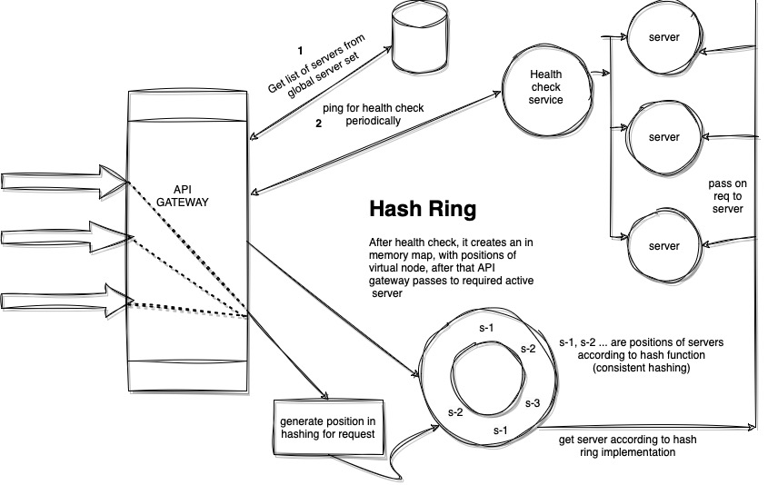
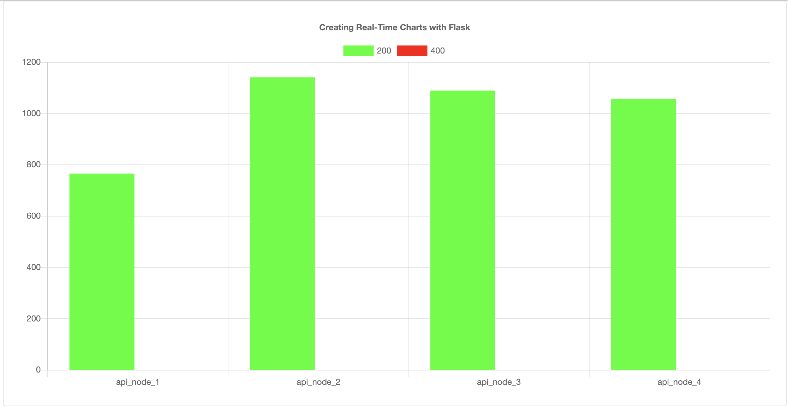
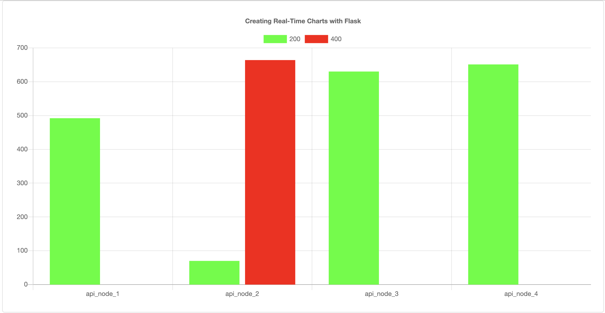
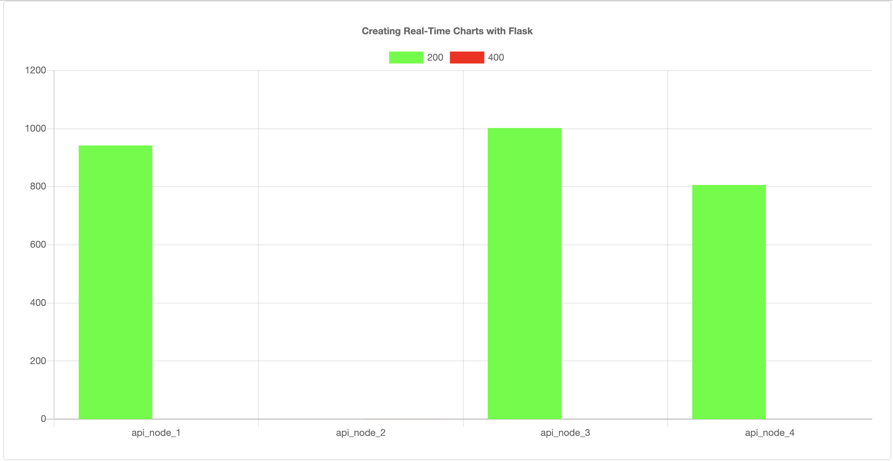

# Creating a toy load balancer using consistent hashing

[Watch Video To Follow Along](https://youtu.be/9TDIp6sckvw)

TO RUN:

0) Install docker and make sure docker daemon is running, install python3
1) clone the repo 
2) run the command: 
```
cd api-gateway && docker build . -t api_gateway && cd .. && 
cd api-server-nodes &&  docker build . -t api_node && cd .. && 
cd py-analytics && docker build . -t py_analytics && cd .. &&  
docker compose up -d

OR

docker compose build && docker compose up -d
```

3) run the following curl to add servers to DB
```
curl --location 'http://localhost:6969/edit-server-in-masterset' \
--header 'Content-Type: application/json' \
--data '{
    "urls":["http://api_node_1:3000", "http://api_node_2:3000", "http://api_node_3:3000", "http://api_node_4:3000"]
}'
```
4) Run the populate python script
```
python3 populate.py
```
5) Open a browser: http://localhost:5050
6) From the docker dashboard you can play with servers by terminating or starting api_node servers

7) To shutdown cluster
```
docker compose down
```
BLOCK DIAGRAM




ALL SERVERS ARE UP



SERVER 2 DOWN



REBALANCING OF REQUESTS

